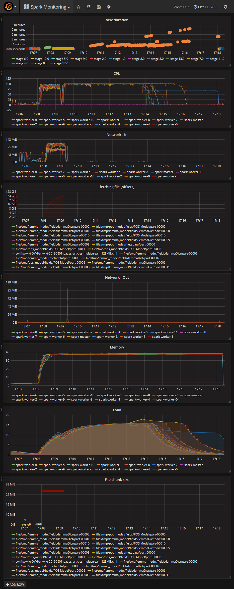

# OVH Labs - Automated monitored Spark cluster deployment for NLP processing

# Setup your VM

```shell
sudo apt-get install --yes python3-venv unzip jq time python-openstackclient python-swiftclient
```

# Install Java-8 on Debian 10

From https://stackoverflow.com/questions/57031649/how-to-install-openjdk-8-jdk-on-debian-10-buster

```shell
echo 'APT::Default-Release "stable";' | sudo tee -a /etc/apt/apt.conf.d/99defaultrelease
```

```shell
cat <<EOF | sudo tee -a /etc/apt/sources.list.d/91-debian-unstable.list
deb http://deb.debian.org/debian sid main
deb-src http://deb.debian.org/debian sid main
EOF
```

```shell
sudo apt-get update
apt-cache policy openjdk-8-jdk
sudo apt-get install --yes -t unstable openjdk-8-jdk
```

To automate the last step and prevent the dialog box about auto-restarting service after the install

```shell
echo '* libraries/restart-without-asking boolean true' | sudo debconf-set-selections
```

And finally, configure your java environment (You don't need to do it if you haven't installed another java version)

```shell
sudo update-alternatives --config java
```

# Gather your access token

You need:

- an OpenStack user credential
- an OVH Metrics WRITE token
- an OVH Metrics READ token
- an OVH Logs WRITE token
- an OVH Logs token

Create a file `config.sh` based on the template `config.sh.sample` and source it `. ./config.sh`

Check the config [help](docs_config/README.md)

# Compile spark

We are going to compile spark for Hadoop 3.2

```shell
make spark
```

# Start the cluster

```shell
make -C cluster cluster-create
```

# Compile the Spark job

```shell
make -C demo assembly
```

# TODO

Upload the wikipedia dump in a swift container

# Start the log analyser

In a separate terminal

```shell
make -C logs run
```

# Compute the XML schema

```shell
make -C demo compute-schema-local 
```

# Count the verbs

```shell
make -C demo demo
```

# Results



```shell
[32] Took PT11M28.483S to process
List of verbs
+---------+-------+
|     verb|  count|
+---------+-------+
|       be|2056592|
|     have| 561995|
|  include| 213493|
|    close| 144669|
|     make| 130782|
|       do| 127276|
|      use| 110360|
|        s| 106669|
|     know|  83623|
|      say|  82392|
|     take|  80336|
|   become|  70640|
|   follow|  69466|
|     give|  67397|
|      see|  65822|
|    write|  64243|
|     keep|  62733|
|     play|  58329|
|       go|  54537|
|     work|  54204|
|     find|  54038|
|     call|  52027|
|      win|  51467|
|     lead|  50602|
|   create|  47201|
|     come|  46963|
|      get|  45303|
|  provide|  44157|
|     show|  42106|
|     hold|  40506|
|    leave|  38544|
|    serve|  37997|
|  publish|  36664|
|     live|  36220|
|     base|  36127|
|   appear|  34174|
|  receive|  34165|
|    begin|  32922|
|      set|  32511|
|  contain|  31916|
|    think|  31826|
|  support|  31774|
|    start|  31174|
|    state|  30509|
|      run|  29761|
|    allow|  29707|
|establish|  29330|
| consider|  29161|
| describe|  28985|
| continue|  28846|
|     bear|  28360|
|   accord|  27375|
|     race|  27068|
|      add|  26820|
|  release|  26452|
|     lose|  26091|
|     need|  25833|
|  produce|  25524|
|  feature|  25324|
|     mean|  25260|
|     name|  24996|
|  involve|  24933|
|    bring|  23779|
|  develop|  23648|
|     move|  23542|
|  perform|  23467|
|    build|  23289|
|     want|  23273|
|   remain|  23120|
|     help|  22935|
|     form|  22872|
|   relate|  22738|
|  require|  22650|
|represent|  21324|
|  believe|  20334|
|    exist|  20185|
|      end|  19764|
|      try|  19703|
|   report|  19672|
|     pass|  19598|
|     join|  19504|
|     note|  19320|
|   return|  19024|
|    refer|  18908|
|    claim|  18733|
| announce|  18649|
|    cause|  18562|
|      die|  18085|
|  suggest|  17895|
|     look|  17814|
|   record|  17626|
|     seem|  17541|
|   change|  17531|
|     tell|  17502|
|    reach|  17478|
|      put|  17350|
|    carry|  17246|
|associate|  17114|
|     kill|  16997|
| increase|  16960|
+---------+-------+
```